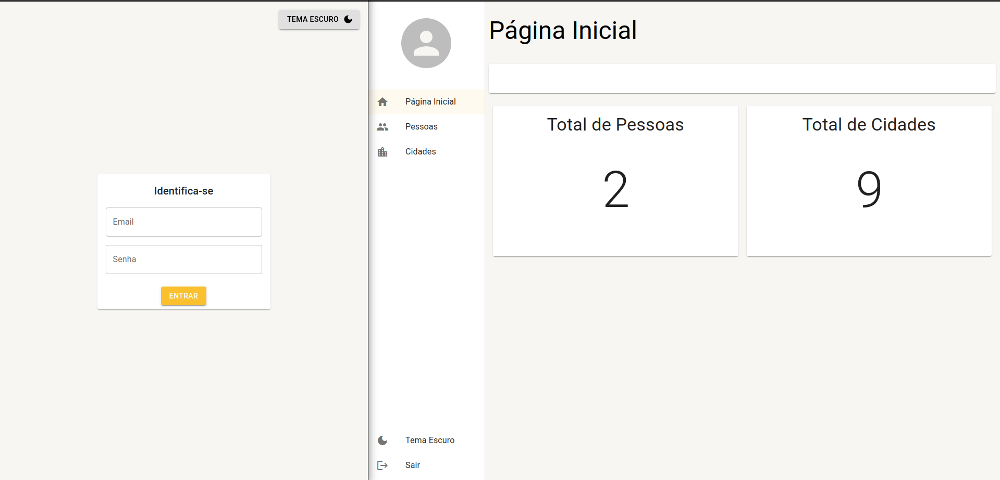

# Preview do projeto



## Projeto

Esse projeto é um sistema de cadastro de pessoas e cidades

#

### Tecnologias Utilizados

<div>
    
    
    
</div>

#

### Funcionalidades

- [X] Autenticação na página de `login`
- [X] Dashboard com os `resumos`
- [X] Cadastro de `pessoas` e `cidades`
- [X] Ferramenta de listagem para `procura`
- [X] Ferramenta de detalhe para `modificação`
- [X] Troca do tema entre `light` e `dark`
- [X] Logout no botão `sair`

#

### Como executar

Será necessário fazer o clone do projeto 

```
git clone https://github.com/estaeldev/react-materialui-typescript.git
```
Instalar as dependências e executar o script de inicialização

```
yarn

yarn start
```

Iniciar o backend mock [**`Json Server`**](https://www.npmjs.com/package/json-server)

```
yarn mock_server
```

#
